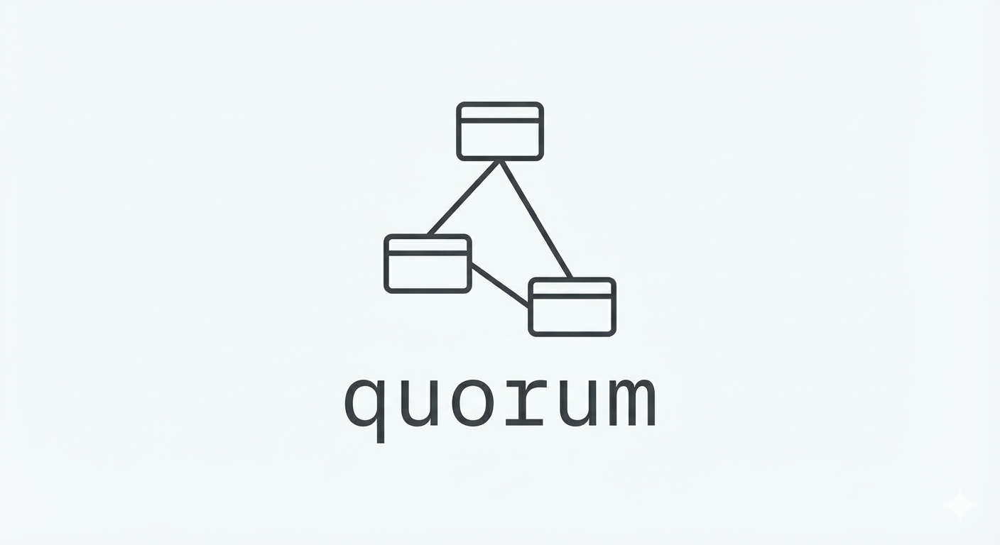

<div align="center">
  
  <h1>Collaborative SQL Query Management</h1>
  <p>
    <strong>Version Control & Peer Review for SQL</strong>
  </p>
  <p>
    Manage, version, and approve SQL queries with your team. Self-hosted or cloud-ready.
  </p>
</div>

<div align="center">

[](LICENSE)
[](https://github.com/montrellcruse/quorum-sql/actions/workflows/ci.yml)
[](https://github.com/montrellcruse/quorum-sql/actions/workflows/codeql.yml)


</div>

## 📖 About

**Quorum** is a team-based SQL query management platform with built-in version control and approval workflows. The name reflects the core feature—configurable approval quotas (a *quorum* is the minimum needed for a decision).

Unlike shared folders or wikis, Quorum provides:
- **Git-like version history** for every query change
- **Mandatory peer review** before queries go live
- **Team isolation** with database-level security
- **Full audit trail** of who changed what and when

Perfect for data teams, analytics engineers, and anyone who needs governance over shared SQL.

## ✨ Key Features

| Feature | Description |
|---------|-------------|
| **🔒 Team Isolation** | Multi-tenant architecture with Row-Level Security (RLS). Teams only see their own data. |
| **📝 Version Control** | Complete change history with diff views and rollback capability. |
| **✅ Approval Workflows** | Configurable approval quotas per team. Require 1, 2, or more reviewers. |
| **👥 Peer Review** | Self-approval prevented at the database level. Changes require teammates. |
| **🔑 Role-Based Access** | Admin and member roles with granular permissions. |
| **🏠 Self-Hosted Option** | Run on your own infrastructure with Docker. No vendor lock-in. |
| **☁️ Cloud Ready** | Deploy to Supabase for managed PostgreSQL and authentication. |
| **📁 Folder Organization** | Hierarchical folders to organize queries by project, team, or domain. |

## 🚀 Quick Start

### Option 1: Guided Setup (Recommended)

```bash
git clone https://github.com/montrellcruse/quorum-sql.git
cd quorum-sql
npm install
npm run dev
```

Visit **http://localhost:8080/setup** and follow the configuration wizard.

### Option 2: Docker (Self-Hosted)

```bash
git clone https://github.com/montrellcruse/quorum-sql.git
cd quorum-sql
docker compose up -d db server
npm install && npm run dev
```

Open **http://localhost:8080** to access the application.

## 🛠️ Deployment Options

| Mode | Best For | Auth | Database |
|------|----------|------|----------|
| **Self-Hosted** | Full control, air-gapped environments | Local accounts | PostgreSQL via Docker |
| **Supabase Cloud** | Quick start, managed infrastructure | Supabase Auth + Google OAuth | Supabase PostgreSQL |

## 💻 Tech Stack

- **Frontend**: [React 18](https://react.dev/) with [Vite 7](https://vitejs.dev/)
- **Language**: [TypeScript 5](https://www.typescriptlang.org/)
- **Styling**: [Tailwind CSS 3](https://tailwindcss.com/) + [shadcn/ui](https://ui.shadcn.com/)
- **Backend**: [Fastify](https://fastify.dev/) REST API
- **Database**: [PostgreSQL 16](https://www.postgresql.org/) with Row-Level Security
- **ORM/Client**: [Supabase JS](https://supabase.com/docs/reference/javascript) or direct REST
- **Validation**: [Zod 4](https://zod.dev/)
- **State**: [TanStack Query](https://tanstack.com/query)

## 🏗️ Architecture

```
┌─────────────────────────────────────────────────────────────┐
│                        Frontend                              │
│  ┌─────────────┐  ┌─────────────┐  ┌─────────────────────┐  │
│  │   React     │  │  TanStack   │  │   Tailwind CSS      │  │
│  │   Router    │  │   Query     │  │   + shadcn/ui       │  │
│  └─────────────┘  └─────────────┘  └─────────────────────┘  │
└────────────────────────────┬────────────────────────────────┘
                             │
              ┌──────────────┴──────────────┐
              ▼                             ▼
┌─────────────────────────┐   ┌─────────────────────────────┐
│   REST API (Fastify)    │   │   Supabase Client (Cloud)   │
│   - JWT Auth            │   │   - Supabase Auth           │
│   - Rate Limiting       │   │   - Google OAuth            │
│   - CORS                │   │   - Real-time (optional)    │
└───────────┬─────────────┘   └──────────────┬──────────────┘
            │                                │
            └──────────────┬─────────────────┘
                           ▼
┌─────────────────────────────────────────────────────────────┐
│                      PostgreSQL                              │
│  ┌─────────────┐  ┌─────────────┐  ┌─────────────────────┐  │
│  │  8 Tables   │  │  37+ RLS    │  │  Security Definer   │  │
│  │             │  │  Policies   │  │  Functions          │  │
│  └─────────────┘  └─────────────┘  └─────────────────────┘  │
└─────────────────────────────────────────────────────────────┘
```

## 📊 Database Schema

8 tables with comprehensive Row-Level Security:

| Table | Purpose |
|-------|---------|
| `profiles` | User information synced with auth |
| `teams` | Team settings + approval quotas |
| `team_members` | User-team relationships with roles |
| `team_invitations` | Pending invitations by email |
| `folders` | Hierarchical query organization |
| `sql_queries` | Versioned query storage |
| `query_history` | Complete change audit trail |
| `query_approvals` | Approval tracking per version |

See [supabase/ERD.md](supabase/ERD.md) for the full entity relationship diagram.

## ⚙️ Configuration

### Environment Variables

Copy `.env.example` to `.env` and configure:

```bash
# Database Provider: 'rest' (self-hosted) or 'supabase' (cloud)
VITE_DB_PROVIDER=rest

# Self-Hosted Mode
VITE_API_BASE_URL=http://localhost:8787
VITE_AUTH_PROVIDERS=local

# OR Supabase Mode
VITE_SUPABASE_URL=https://your-project.supabase.co
VITE_SUPABASE_PUBLISHABLE_KEY=your-anon-key

# Common Settings
VITE_ALLOWED_EMAIL_DOMAIN=@yourcompany.com
VITE_APP_NAME=Quorum
```

### Setup Wizard

The setup wizard at `/setup` guides you through:

1. **Choose Provider** — Self-Hosted or Supabase Cloud
2. **Configure Settings** — Email domain restrictions, app name
3. **Generate Config** — Download your `.env` file

## 📈 Observability

Frontend telemetry supports:

- **Sentry** error tracking (`VITE_SENTRY_DSN`, `VITE_SENTRY_ENV`, `VITE_SENTRY_TRACES_SAMPLE_RATE`)
- **PostHog** product analytics (`VITE_POSTHOG_KEY`, `VITE_POSTHOG_HOST`)

### Error-to-issue automation (Sentry → GitHub)

Sentry is initialized in `src/lib/telemetry.ts`, but GitHub issue creation is configured in Sentry, not in this repo.
Follow the placeholder runbook to enable or document the integration: `runbooks/sentry-github.md`.

## 📜 Scripts

| Command | Description |
|---------|-------------|
| `npm run dev` | Start development server on port 8080 |
| `npm run build` | Build for production |
| `npm run lint` | Run ESLint |
| `npm run preview` | Preview production build |
| `npm run setup:docker` | Run Docker setup script |

## 🔒 Security

Quorum is built with security as a core principle:

- **37+ RLS Policies** — Database-level access control on all tables
- **Team Isolation** — Users only see their teams' data
- **Peer Review Enforcement** — Self-approval prevented at database level
- **Domain Restriction** — Configurable email domain authentication
- **SQL Injection Protection** — Parameterized queries throughout
- **XSS Protection** — React's automatic escaping + CSP headers
- **Security Definer Functions** — Controlled privilege elevation with `SET search_path`

See [SECURITY.md](SECURITY.md) for the complete security policy and audit history.

## 📁 Project Structure

```
├── src/
│   ├── components/        # React components
│   │   ├── setup/         # Setup wizard
│   │   └── ui/            # shadcn/ui components
│   ├── contexts/          # Auth & Team React contexts
│   ├── pages/             # Route page components
│   ├── hooks/             # Custom React hooks
│   └── integrations/      # Supabase client config
├── server/                # Fastify REST API
│   ├── src/
│   │   ├── routes/        # API route handlers
│   │   └── middleware/    # Auth, rate limiting
│   └── package.json
├── supabase/
│   ├── migrations/        # 46 database migrations
│   ├── schema.sql         # Schema documentation
│   └── ERD.md             # Entity relationship diagram
├── docker-compose.yml     # Docker services config
└── .env.example           # Environment template
```

## 🤝 Contributing

Contributions are welcome! Please follow these steps:

1. **Fork** the repository
2. **Create** a feature branch (`git checkout -b feature/amazing-feature`)
3. **Test** your changes (`npm run lint && npm run build`)
4. **Commit** with a clear message (`git commit -m 'Add amazing feature'`)
5. **Push** to your branch (`git push origin feature/amazing-feature`)
6. **Open** a Pull Request

See [CONTRIBUTING.md](CONTRIBUTING.md) for detailed guidelines.

## 📄 License

This project is licensed under the MIT License — see [LICENSE](LICENSE) for details.

## 🆘 Support

- **Issues**: [GitHub Issues](https://github.com/montrellcruse/quorum-sql/issues)
- **Security**: [SECURITY.md](SECURITY.md) for vulnerability reporting
- **Database Docs**: [supabase/README.md](supabase/README.md)

---

<div align="center">
  <sub>Built for teams who care about SQL governance</sub>
</div>
