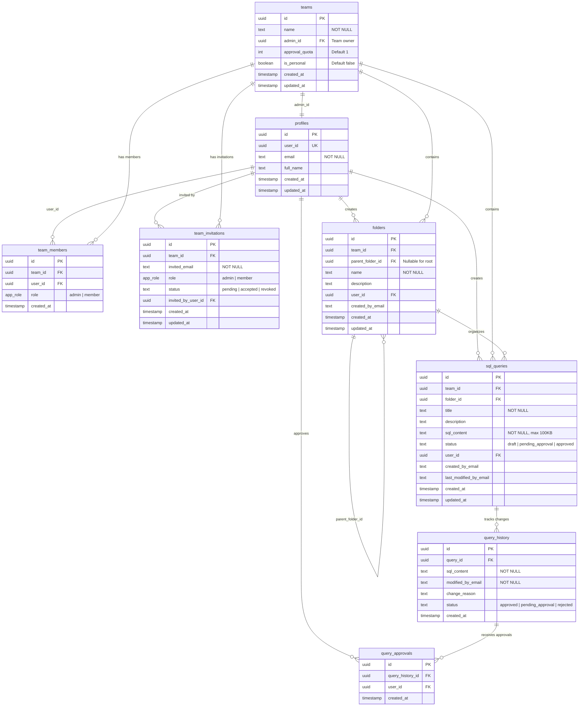

# Entity Relationship Diagram

This document provides a visual representation of the Quorum database schema.

## Database Schema Diagram



## Table Relationships Explained

### Core Relationships

1. **profiles → team_members → teams**
   - Users (profiles) belong to multiple teams via team_members
   - Each team membership has a role (admin or member)
   - One-to-many from profiles to team_members
   - Many-to-one from team_members to teams

2. **teams → folders → sql_queries**
   - Teams contain folders (organizational structure)
   - Folders contain SQL queries
   - Folders can be nested (parent_folder_id self-reference)
   - All data is team-scoped for isolation

3. **sql_queries → query_history → query_approvals**
   - Each query modification creates a history record
   - History records track approval status
   - Multiple users can approve each history record
   - Peer review enforced at database level

4. **team_invitations**
   - Standalone invitation tracking
   - Links team_id to invited_email
   - Converts to team_members when accepted

### Key Constraints

- **Unique Constraints**:
  - `profiles.user_id` (one profile per auth user)
  - `team_members(team_id, user_id)` (one role per user per team)
  - `query_approvals(query_history_id, user_id)` (one approval per user per version)

- **Check Constraints**:
  - `team_members.role` uses `app_role` enum ('admin', 'member')
  - `team_invitations.role` uses `app_role` enum ('admin', 'member')
  - `team_invitations.status IN ('pending', 'accepted', 'revoked')`
  - `query_history.status IN ('pending_approval', 'approved', 'rejected')`
  - `sql_queries.sql_content` max 100KB via CHECK constraint

- **Foreign Keys**:
  - All relationships use UUID foreign keys
  - ON DELETE CASCADE on most foreign keys (team deletion cascades to members, folders, queries)
  - `team_invitations.invited_by_user_id` uses ON DELETE SET NULL

## Data Flow Examples

### Creating a Query

```
User creates query
    ↓
sql_queries (status: 'draft')
    ↓
User submits for approval
    ↓
query_history created (status: 'pending_approval')
    ↓
sql_queries.status = 'pending_approval'
    ↓
Team members approve
    ↓
query_approvals created (one per approver)
    ↓
When approval_quota met
    ↓
sql_queries.status = 'approved'
    ↓
query_history.status = 'approved'
```

### Team Invitation Flow

```
Admin invites user
    ↓
team_invitations created (status: 'pending')
    ↓
User receives invitation
    ↓
User accepts
    ↓
team_members created
    ↓
team_invitations.status = 'accepted'
```

### Folder Hierarchy

```
Root Folder (parent_folder_id: NULL)
    ├─ Subfolder 1 (parent_folder_id: Root)
    │   ├─ Query 1
    │   └─ Query 2
    └─ Subfolder 2 (parent_folder_id: Root)
        └─ Query 3
```

## Security Model

### Row-Level Security (RLS)

All tables have RLS policies enforcing:

1. **Team Isolation**: Users can only access data for their teams
2. **Role-Based Access**: Admins have additional privileges
3. **Owner Rights**: Creators have special permissions
4. **Peer Review**: Self-approval prevented

### Security Definer Functions

Helper functions used by RLS policies:
- `user_teams()` - Returns user's team IDs
- `user_admin_teams()` - Returns teams where user is admin
- `user_can_access_team()` - Verifies team access
- `user_is_team_admin()` - Verifies admin status

All functions use:
- `SECURITY DEFINER` for controlled privilege elevation
- `SET search_path = public` to prevent search path attacks

## Indexes

Performance indexes on frequently queried columns:

- `idx_profiles_user_id` on `profiles(user_id)`
- `idx_profiles_email` on `profiles(email)`
- `idx_teams_admin` on `teams(admin_id)`
- `idx_team_members_user_id` on `team_members(user_id)`
- `idx_team_members_team_id` on `team_members(team_id)`
- `idx_folders_team_id` on `folders(team_id)`
- `idx_folders_parent` on `folders(parent_folder_id)`
- `idx_sql_queries_team_id` on `sql_queries(team_id)`
- `idx_sql_queries_folder_id` on `sql_queries(folder_id)`
- `idx_query_history_query_id` on `query_history(query_id)`
- `idx_query_approvals_history_id` on `query_approvals(query_history_id)`
- `idx_team_invitations_email` on `team_invitations(invited_email)`
- `idx_team_invitations_team` on `team_invitations(team_id)`

## Additional Resources

- **Schema Documentation**: See `schema.sql` for complete SQL definitions
- **Seed Data**: See `seed.sql` for development test data
- **Database Guide**: See `README.md` for setup instructions
- **Security Policy**: See `../SECURITY.md` for security details
